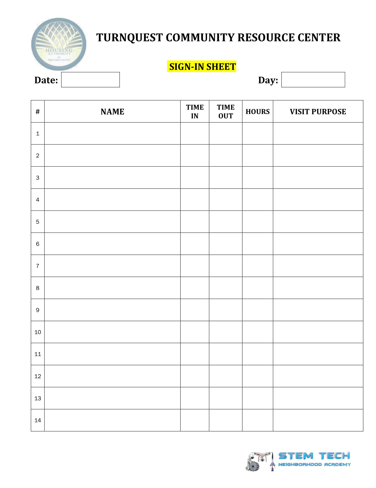
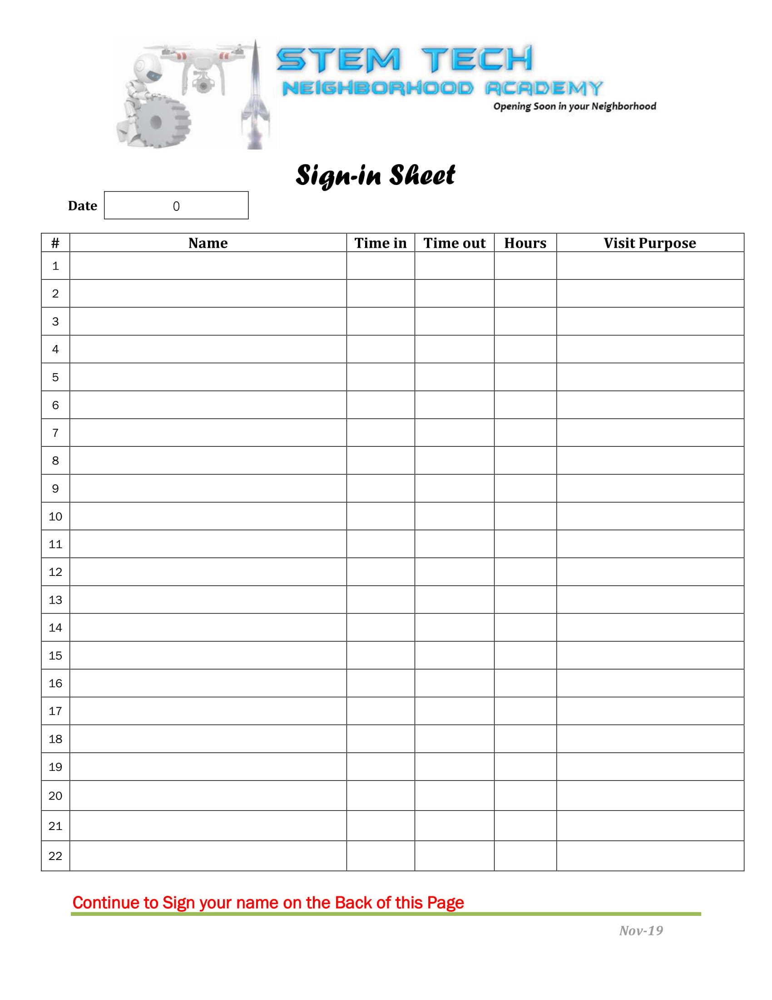
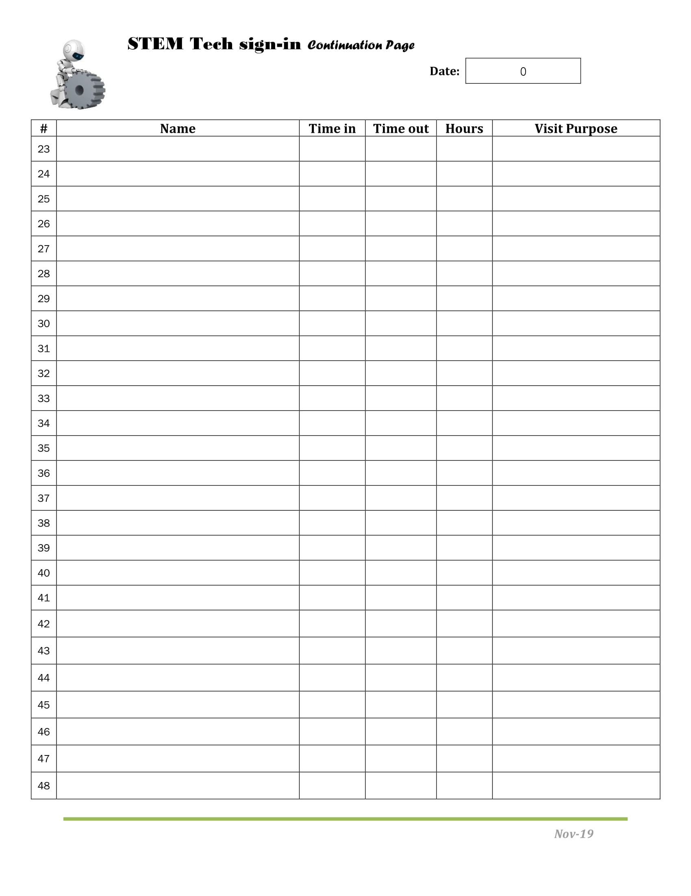

# Signin Sheet Requirements
For the application to do its magic effectively, it needs to be able to clearly find your table and data. To make the process very simple, everything that is to be taken by the program is to be encapsulated in a box. Unfortunately, the application is very ridged in its scraping, but here are the current requirements:
# Requirements:
 * The signin sheet must be held in a black table with no breaks in the lines that make up the table.
 * The table currently has to have 5 cells of input for every line. This may change in the future, but until then, there has to be 5 cells in the table. The application was made for sheets similar to the example below.
 * The sheet should have table headers horizontally and vertically. The application is used to recognizing them and ignoring the first row in a table as they're assumed to be table headers automatically.
 * There is an optional date and day boxes that appear outside of the table that get added to every datapoint made by a user. 
 * Pictures and text can be added to the signinsheet outside of data fields, but only as long as they're not dark enough to be recognized as black boxes. It may take come experimentation to figure out if a graphic is too bright or not, but once you get little to no errors popping up on the monitor, you should be good to start scanning.
 * The columns should be similar to what is given in the examples. The first box represents a name, the last box represents text, and the 2nd and 3rd boxes are dates while the 4th one is a number. The application will attempt to recognize it as such.
 * The signin sheet can be multiple pages, as long as each page comes with their own headers on the top, but sheets with different dates should be kept separate.
 * When using the signin sheet for the application, it is highly recommended that you use a scanner to turn your pages into pdf’s The higher the quality, the better at getting names and dates it will be.

# Examples sheets
## Turnquest

## stemtech

